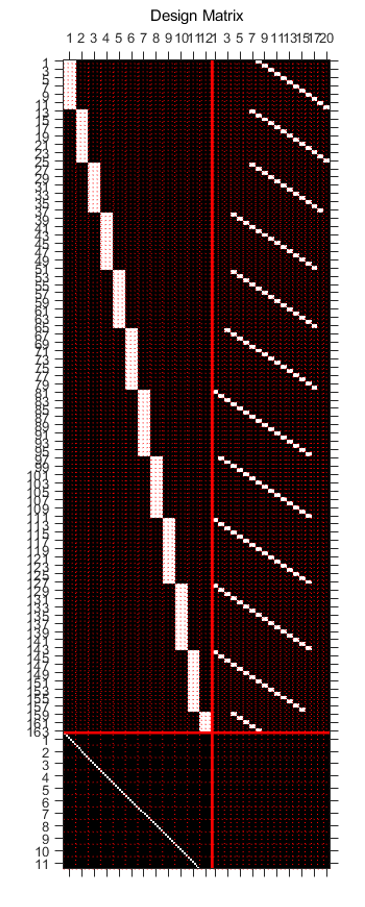
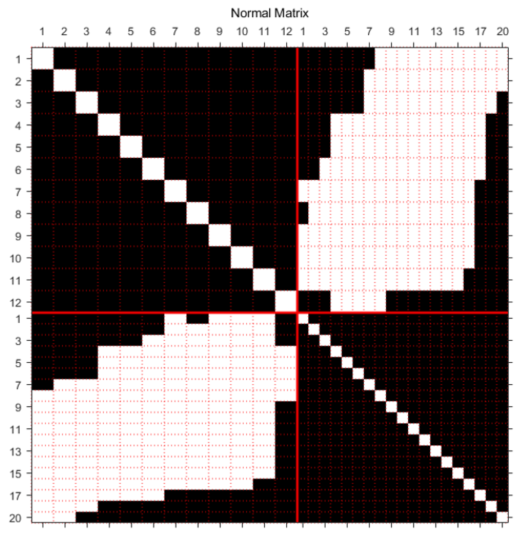
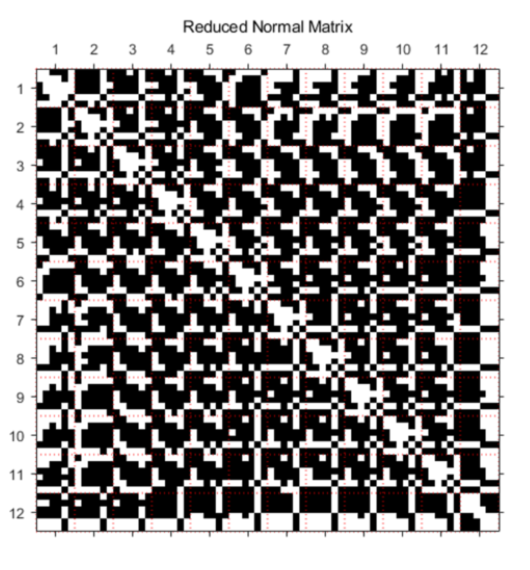
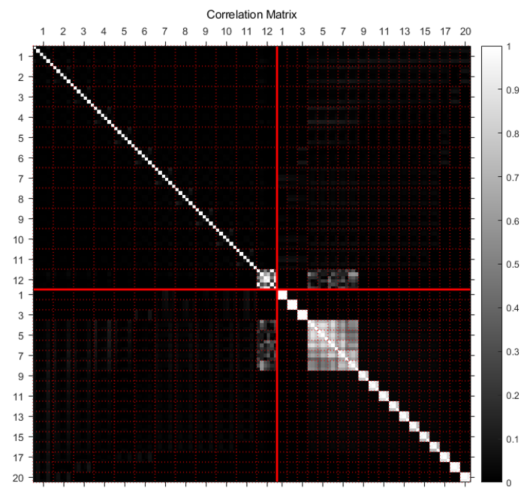
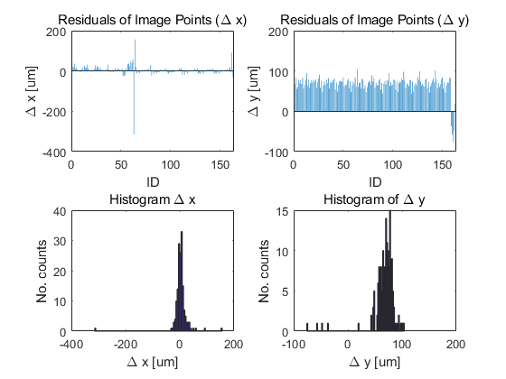
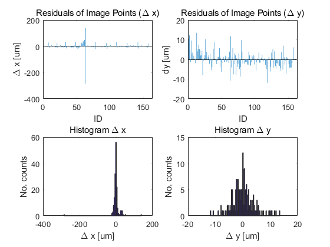

# BA_based_on_Ref_Img
Codes and data for bundle adjustment based on reference images

## Input
* EO_i.txt: An initial value of exterior orientation parameters(EO)
* EO_m.txt: A measured value of EO(from sensor)
* EO_t.txt: A true value of EO(needed to compute RMSE of EO... later)
* GP_i.txt: An initial value of ground points(GP)
* IO_smart.txt: A value of interior orientation parameters(IO) of smartphone images
* IO_t.txt: A value of IO of reference images
* IP_m.txt: Tie-points between reference images and smartphone images
***

## Output
* EO_e.txt: An estimated value of EO of whole images(mainly smartphone images)
* GP_e.txt: An estimated value of GP
* Est_summary.txt: A summary of bundle adjustments(BA)
***
* Fig.1: Design Matrix
  * 
* Fig.2: Normal Matrix
  * 
* Fig.3: Reduced Normal Matrix
  * 
* Fig.4: Correlation Matrix
  * 
* Fig.5: Residuals of IPs before BA
  * 
* Fig.6: Residuals of IPs after BA
  * 
***

## How to execute
### Run AT_Estimate.m !!!
